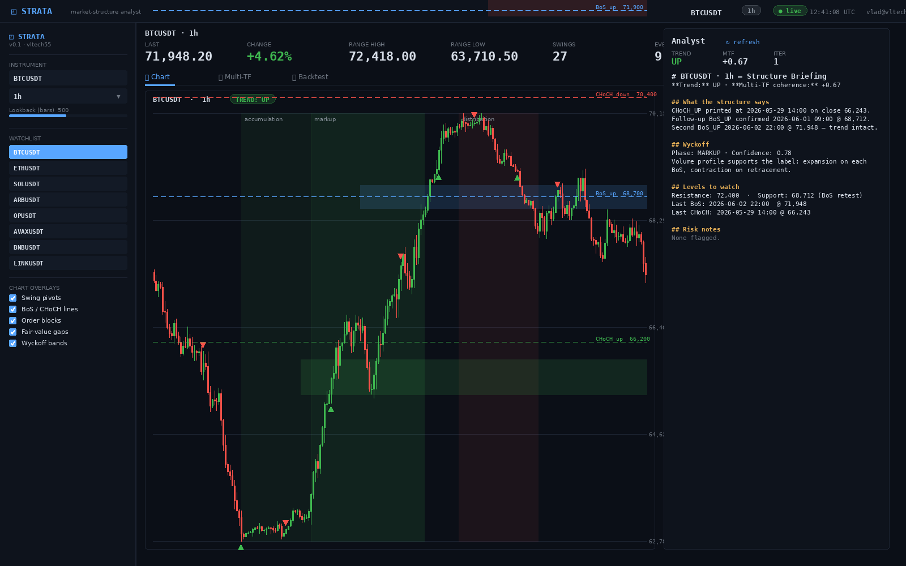
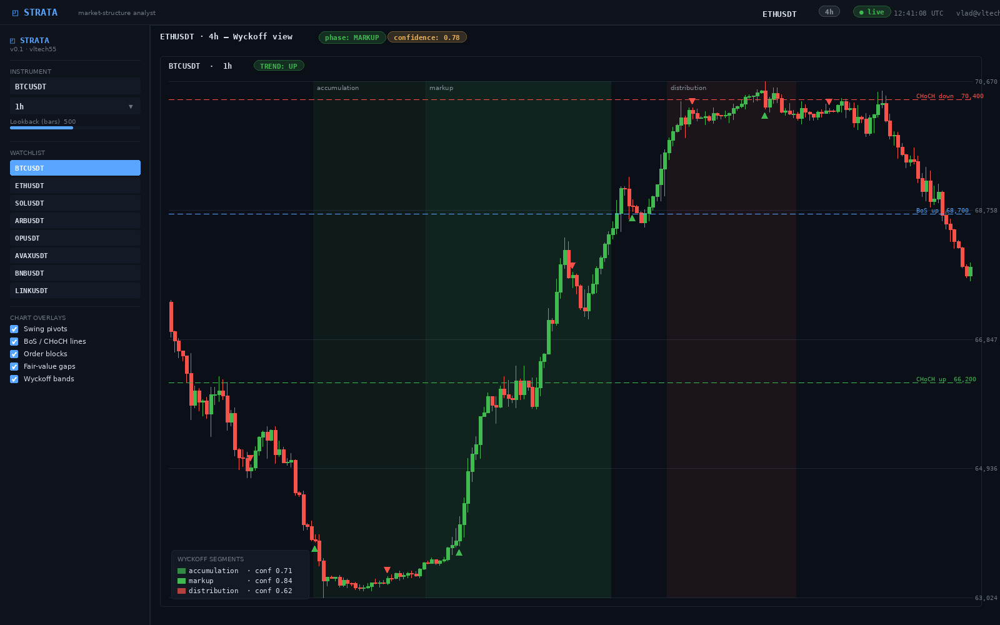
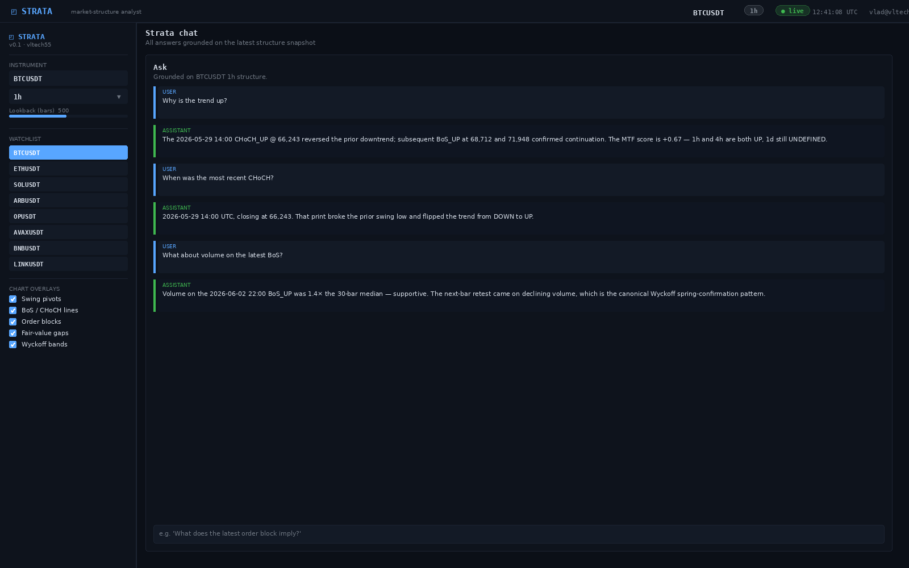
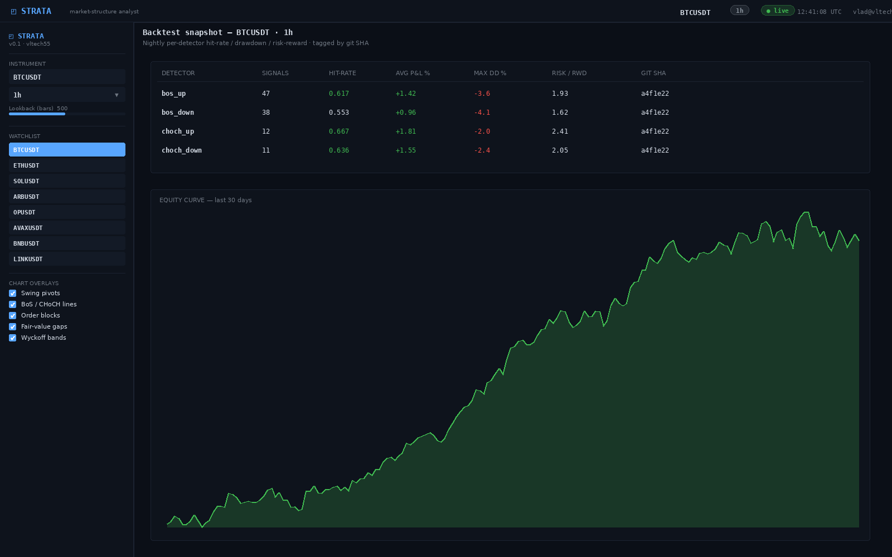
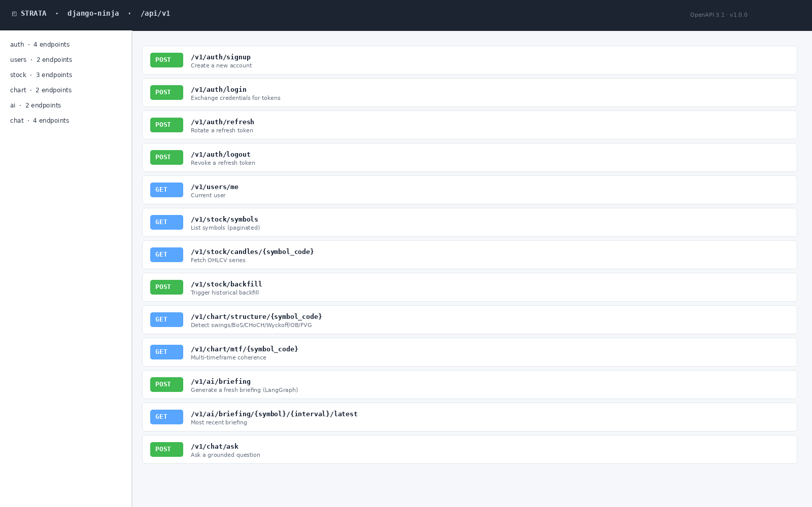
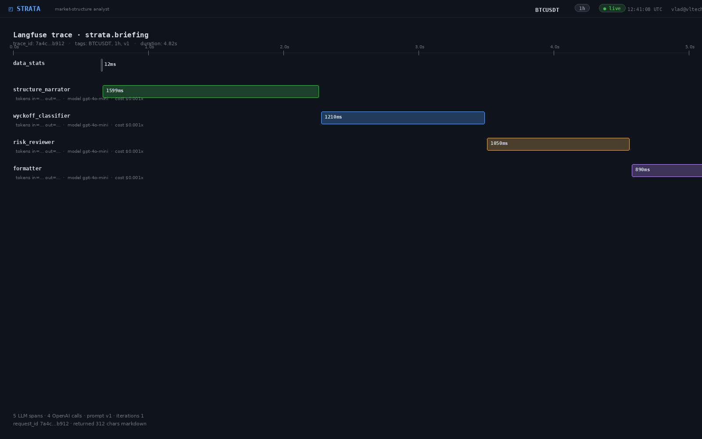

<div align="center">

# Strata — Crypto Market-Structure Analyst

**Production-grade market-structure analysis for crypto: real-time OHLCV ingestion, algorithmic swing / Break-of-Structure / Change-of-Character / Wyckoff detection, a multi-agent LLM pipeline that produces grounded market summaries, and an interactive Streamlit + Plotly workspace — all backed by an async Django 5 + django-ninja REST API.**

[](https://www.python.org/)
[](https://www.djangoproject.com/)
[](https://django-ninja.dev/)
[](https://github.com/langchain-ai/langgraph)
[](https://streamlit.io/)
[](https://docs.celeryq.dev/)
[](https://www.postgresql.org/)
[](https://www.docker.com/)
[](LICENSE)

</div>

## What it does

Strata ingests OHLCV candles from Bybit, applies a pipeline of pandas-native algorithms to detect **swing pivots, Breaks of Structure (BoS), Changes of Character (CHoCH), Wyckoff accumulation/distribution phases, order blocks, and fair-value gaps**, then asks a **LangGraph multi-agent pipeline** to convert those structured findings into a grounded natural-language market briefing. Users explore symbols and timeframes through a **Streamlit + Plotly workspace** with chart overlays for every detection, and can ask follow-up questions in a chat panel that has the full structure context.

A separate **backtest harness** replays the same detectors over historical data to produce hit-rate / drawdown / payoff numbers per symbol/timeframe, so changes to the algorithms can be evaluated objectively rather than by visual inspection.

## Features

- **Multi-feature structure detection** — fractal-pivot swing detection, BoS / CHoCH (with separated bullish/bearish trend states), Wyckoff phase classifier, order-block and fair-value-gap detection, multi-timeframe coherence scoring. Pure pandas/NumPy, vectorized, no per-candle Python loops on the hot path.
- **LangGraph multi-agent briefing pipeline** — data-stats → structure narrator → Wyckoff classifier → risk reviewer → formatter, with conditional revise-loop on low-confidence narratives. Langfuse traces every node call, every prompt, every token.
- **Async Django 5 + django-ninja REST API** — domain-separated apps (`ai`, `chat`, `stock`, `auth`, `chart`, `users`), Pydantic schemas, async ORM queries, custom managers for time-series queries.
- **Streamlit + Plotly workspace** — `graph_objects` candlestick chart with overlay layers (swings, BoS lines, CHoCH labels, Wyckoff zones, order blocks, FVGs), AI summary panel, chat with structure context, session state + localStorage token persistence via `streamlit-local-storage`.
- **Celery + Redis background layer** — periodic OHLCV refresh, on-demand structure recomputation, AI briefing generation, beat-scheduled health probes.
- **Bybit REST integration** — paginated kline fetch with exponential backoff, rate-limit-aware client, server-side timestamp validation.
- **JWT RS256 auth** — asymmetric key pair, access + refresh token rotation, `cryptography`-library key loading, configurable TTLs.
- **Production deploy** — multi-stage Dockerfile (slim runtime, no build tools), `docker compose` stack for backend + worker + beat + Postgres + Redis + MinIO + Streamlit, uWSGI for the API container, OpenTelemetry + Sentry instrumentation.
- **Backtest harness** — replays detections over historical data, computes hit-rate / max-drawdown / risk-reward per detector per symbol, persisted with the git SHA so detector tweaks are A/B-comparable.

## Screenshots

<table>
<tr>
<td width="50%"></td>
<td width="50%"></td>
</tr>
<tr>
<td></td>
<td></td>
</tr>
<tr>
<td></td>
<td></td>
</tr>
</table>

## Stack

| Layer            | Tech |
|------------------|------|
| Backend          | Python 3.13, Django 5 (async), django-ninja, Pydantic v2, SQLAlchemy-style custom managers on Django ORM |
| Database         | PostgreSQL 16 (psycopg3, async driver), Alembic-style Django migrations |
| Task layer       | Celery + Redis (broker + result backend), celery-beat, durable retry with backoff |
| AI / LLM         | LangChain, LangGraph, OpenAI, Langfuse (prompt tracing + cost), Pydantic-validated structured output |
| Frontend         | Streamlit, Plotly `graph_objects`, `streamlit-local-storage` for token persistence |
| Market data      | Bybit public REST API, `ta` library for indicator helpers, pandas / NumPy core |
| Auth             | JWT RS256 via `python-jose` and `cryptography`, access + refresh token rotation |
| Object storage   | MinIO (S3-compatible) for chart snapshots and report artifacts |
| Observability    | Langfuse (LLM), OpenTelemetry (HTTP + Celery), Sentry (errors), structlog (JSON) |
| Ops              | Multi-stage Dockerfile, docker compose, uWSGI, pre-commit, ruff, mypy, pytest |

## Architecture

```
                          ┌──────────────────────────────────────────────┐
                          │            Streamlit workspace                │
                          │  symbol/TF selector · Plotly candlestick      │
                          │  overlays · summary panel · chat              │
                          └────────┬─────────────────────────▲────────────┘
              REST (JWT RS256)     │  api_client             │ chat & summary
                                   ▼                         │ (SSE-streamed)
        ┌──────────────────────────────────────────────────────────────────┐
        │     Django 5 async + django-ninja  (uWSGI in production)          │
        │                                                                    │
        │   apps/users · apps/auth (RS256 access + refresh)                  │
        │   apps/stock (Bybit client + ingestion)  ──────┐                   │
        │   apps/chart (swing / BoS / CHoCH / Wyckoff /  │                   │
        │               order blocks / FVG / MTF coh.)   │                   │
        │   apps/ai    (LangGraph multi-agent pipeline)──┼───── Langfuse     │
        │   apps/chat  (chat sessions over structure)    │                   │
        └────────────┬───────────────────────┬───────────┘                   │
                     │ ORM                    │ enqueue                       │
                     ▼                         ▼                              │
            ┌────────────────┐         ┌──────────────────┐                  │
            │ PostgreSQL 16  │         │  Celery + Redis  │  beat-scheduled  │
            │ Symbol·Candle  │         │  ingestion ·      │  ingestion +      │
            │ Detection·Chat │         │  detection · AI   │  health probes    │
            └────────┬───────┘         └──────────────────┘                  │
                     │                                                        │
                     │ snapshots + reports                                    │
                     ▼                                                        │
            ┌────────────────┐         ┌──────────────────┐                  │
            │ MinIO (S3)     │         │ Bybit public API │ ────────────────▶│
            └────────────────┘         └──────────────────┘                   │
                                                                              │
        Sentry · OpenTelemetry (HTTP + Celery)  ───────────────────────────────┘
```

## Run locally

```bash
git clone https://github.com/vltech55/strata-market-structure
cd strata-market-structure
cp .env.example .env       # add OPENAI_API_KEY, optional LANGFUSE_* and SENTRY_DSN
make keys                  # generate the RS256 keypair into ./keys/
docker compose up -d --build
docker compose exec backend python manage.py migrate
docker compose exec backend python manage.py loaddata fixtures/seed.json   # demo symbols
docker compose exec backend python manage.py createsuperuser
```

- **Streamlit workspace:** http://localhost:8501
- **django-ninja API + OpenAPI explorer:** http://localhost:8000/api/docs
- **MinIO console:** http://localhost:9001 (`minioadmin` / `minioadmin`)
- **Flower (Celery monitor):** http://localhost:5555

A `Makefile` provides the rest: `make test`, `make lint`, `make fmt`, `make backtest`, `make seed`.

## Tests

```bash
docker compose exec backend pytest
```

The headline tests are in `backend/tests/test_structure_detection.py` — they exercise the swing/BoS/CHoCH/Wyckoff detectors against synthesized OHLCV fixtures with known answers, including pathological cases (flat price, single bar, all-up / all-down series, gap candles). The AI pipeline has a smoke test that runs the LangGraph against a mock OpenAI client to verify state flow and output schema validation without burning tokens.

## License

MIT
